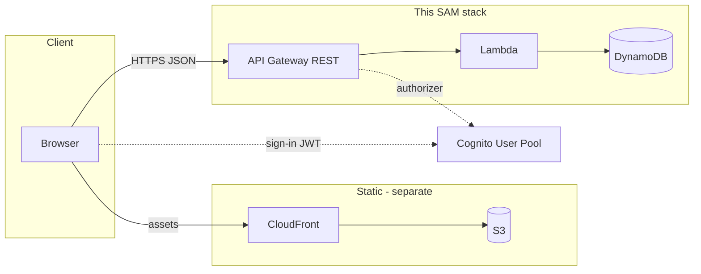

# Backend guides

**Committed** references for this repo’s SAM stack: *what each AWS service does*, *how it is defined in* [`template.yaml`](../template.yaml), *console-style equivalents*, *security and ops settings to check*, *what to extend next*.

**Umbrella (overview + security themes):** [`../../docs/aws-setup-and-security.md`](../../docs/aws-setup-and-security.md).

**Deployable source of truth:** [`../README.md`](../README.md) (commands and outputs) · [`../template.yaml`](../template.yaml) · [`../functions/api/handler.mjs`](../functions/api/handler.mjs).

**Reading order:** [01](01-tooling-aws-cli-sam.md) → [02](02-dynamodb.md) → [03](03-api-gateway.md) → [04](04-lambda.md) → [05](05-cognito.md) → [06](06-iam-and-security.md) → [07](07-deploy-sam.md) → [08](08-frontend-wiring.md).

**Documentation index:** [`../../docs/INDEX.md`](../../docs/INDEX.md).

---

## Architecture (this stack)

Cognito issues JWTs; API Gateway validates them before Lambda runs. The SPA is not deployed by this template—wire it per [08](08-frontend-wiring.md).

| Guide | Topic |
| ----- | ----- |
| [01](01-tooling-aws-cli-sam.md) | AWS CLI + SAM CLI |
| [02](02-dynamodb.md) | Single-table `PK` / `SK` |
| [03](03-api-gateway.md) | REST API, CORS, default authorizer |
| [04](04-lambda.md) | Node 20 handler, proxy event |
| [05](05-cognito.md) | User pool, app client, JWT |
| [06](06-iam-and-security.md) | Execution role, least privilege |
| [07](07-deploy-sam.md) | `sam build`, `sam deploy`, outputs |
| [08](08-frontend-wiring.md) | `PUBLIC_API_URL`, dev token |
