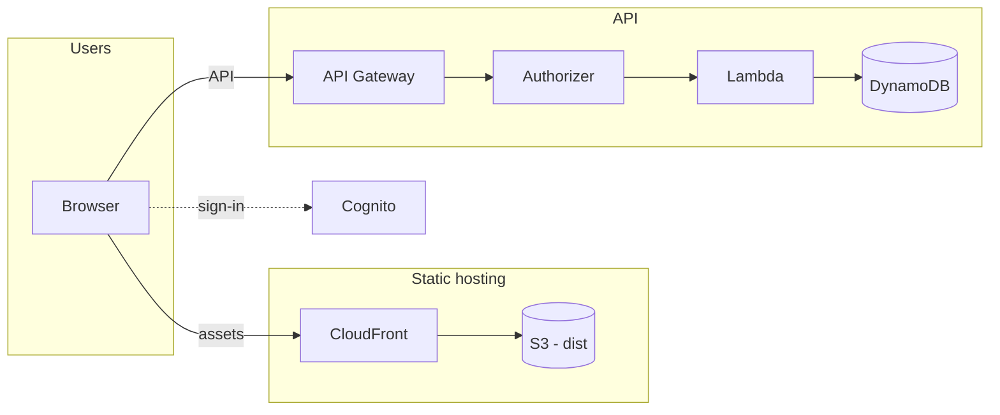

# Serverless implementation guide

This document plus [`serverless-fitness-data.md`](./serverless-fitness-data.md) are enough to **implement the full comparable stack** end to end—you do **not** need any external course. Work through the **phases in order**; each phase has **verification** before you move on.

**Navigation:** [**`INDEX.md`**](./INDEX.md) is the suggested **reading order** (Part I core stack, Part II extensions). For **AWS building blocks** as implemented in this repo (CLI, DynamoDB, API Gateway, Lambda, Cognito, IAM, SAM deploy, frontend env), use **[`backend/guides/`](../backend/guides/README.md)**—short references keyed to [`template.yaml`](../backend/template.yaml). This file stays the **long-form phase walkthrough** (bootstrap, verification, hosting, troubleshooting, usage plans).

**Hands-on with this repo’s SAM stack:** **§§2.1–2.4** cover **deploy permissions and stack lifecycle**, **frontend `.env` + Bun `PUBLIC_*` inlining**, a **baseline working app** checklist (outputs, Cognito sign-up/confirm, compare API, DynamoDB `USER#<sub>`), and **low-hanging fruit** before you extend features—then continue with the numbered phases.

**Frontend** lives in [`frontend/`](../frontend/). **Reference backend (SAM)** lives in [`backend/`](../backend/)—deploy it or use it as a blueprint for your own stack. S3 + CloudFront for the SPA are still separate (see Phase 5).

| You need | Document / folder |
| -------- | ----------------- |
| Phases 1–8, optional usage plans / API keys, hosting, deployment, frontend wiring | **This file** |
| Reading order, Part I / II map | [`INDEX.md`](./INDEX.md) |
| Per-service backend reference (SAM template sections) | [`backend/guides/`](../backend/guides/README.md) |
| Fitness entities, DynamoDB `PK`/`SK`, `/me/...` routes, Lambda rules | [`serverless-fitness-data.md`](./serverless-fitness-data.md) |
| Ready-to-deploy compare API + Cognito + DynamoDB (extend for full fitness) | [`backend/`](../backend/) |

---

## 1. What lives where

| Piece | Where it lives |
| ----- | --------------- |
| React SPA (Bun, Tailwind, shadcn-style UI) | **This repo** — [`frontend/`](../frontend/) |
| Reference SAM stack (compare routes + table + Cognito) | **This repo** — [`backend/`](../backend/) (optional; extend per docs) |
| S3 + CloudFront (static SPA) | **Your AWS account** (not committed here) |
| Fitness schema and API contract | [`serverless-fitness-data.md`](./serverless-fitness-data.md) |

---

## 2. Prerequisites (install and configure)

**Account:** billing alerts, **one region** for all resources, **AWS CLI** + **SAM CLI** working (`aws sts get-caller-identity`, `sam --version`). **Bun** for the frontend ([`README.md`](../README.md)). **Concepts:** HTTP/JSON/JWT; **`sub`** from Cognito is the user id ([`serverless-fitness-data.md`](./serverless-fitness-data.md)).

**Tooling reference:** [`backend/guides/01-tooling-aws-cli-sam.md`](../backend/guides/01-tooling-aws-cli-sam.md).

### 2.1 Deploy permissions and stack lifecycle

- **IAM:** The principal you use for `sam deploy` must allow CloudFormation to create **IAM roles** for Lambda (`iam:CreateRole`, `iam:PassRole`, `iam:TagRole` / `iam:UntagRole` as needed). Without that, create fails on the Lambda execution role and the stack rolls back.
- **Changeset:** On first `sam deploy --guided`, confirm **deploy** when prompted (`y`). If the stack stays **`REVIEW_IN_PROGRESS`**, execute the pending change set in the console or run `sam deploy` again and confirm.
- **Failed create:** If the stack ends in **`ROLLBACK_COMPLETE`**, delete it before reusing the same stack name. **Rollback guide:** [`backend/guides/07-deploy-sam.md`](../backend/guides/07-deploy-sam.md) (Rollback guide + `aws cloudformation delete-stack`).
- **Outputs:** After **`CREATE_COMPLETE`**, capture stack outputs (CLI or console). Example:

```bash
aws cloudformation describe-stacks \
  --stack-name comparable-backend \
  --region eu-west-1 \
  --query "Stacks[0].Outputs" \
  --output table
```

### 2.2 Frontend env and Bun (this repo)

- Copy [`frontend/.env.example`](../frontend/.env.example) → **`frontend/.env`**. Use **`KEY=value`** with **no spaces** around `=`.
- Set **`PUBLIC_API_URL`** (stack `ApiUrl`, no trailing slash), **`PUBLIC_COGNITO_USER_POOL_ID`**, **`PUBLIC_COGNITO_CLIENT_ID`** from the same stack as the API.
- **Dev:** `bun run dev` from [`frontend/`](../frontend/) loads **`--env-file=.env`** (see [`frontend/package.json`](../frontend/package.json)). Bun’s HTML bundler inlines **literal** `process.env.PUBLIC_*` into the browser bundle—do not gate reads on `typeof process` or indirect access ([`frontend/src/env.ts`](../frontend/src/env.ts), [`frontend/bunfig.toml`](../frontend/bunfig.toml)).
- **Full wiring:** [`backend/guides/08-frontend-wiring.md`](../backend/guides/08-frontend-wiring.md).

### 2.3 Baseline “working app” before new features

Use this as a **definition of done** when the stack is deployed and you want to extend the app safely:

1. Stack **`CREATE_COMPLETE`**; outputs recorded.
2. **`frontend/.env`** correct; **`bun run dev`**; Cognito config resolves (no empty pool/client ids).
3. **Sign up** in the app with a real inbox → **confirm email** (verification code) → **sign in** ([`backend/template.yaml`](../backend/template.yaml): email verification, public app client).
4. **Compare** flow works against the **deployed** API (GET / POST / DELETE as implemented).
5. **DynamoDB:** **Explore table items** on the stack’s fitness table—rows keyed by **`USER#<sub>`** per [`serverless-fitness-data.md`](./serverless-fitness-data.md).
6. (Recommended) **Second user** to confirm isolation by **`sub`**.

**Optional sanity checks:** API Gateway **Stages** → **`Prod`** matches `PUBLIC_API_URL`; Cognito **App client** id matches **`PUBLIC_COGNITO_CLIENT_ID`**; CloudWatch Logs **Lambda** on 5xx ([`docs/aws-setup-and-security.md`](./aws-setup-and-security.md)).

### 2.4 Low-hanging fruit (before bigger feature work)

| Area | Action | Where |
| ---- | ------ | ----- |
| Cognito | Stronger password policy; optional/required **MFA**; tune **token expiration** on the app client. | [`backend/guides/05-cognito.md`](../backend/guides/05-cognito.md) |
| **Email** | Production **SES** for Cognito mail (deliverability). | [`backend/guides/05-cognito.md`](../backend/guides/05-cognito.md) |
| **CORS** | Template may use **`AllowOrigin: '*'`**; tighten to your dev + CloudFront origins. | [`aws-setup-and-security.md`](./aws-setup-and-security.md) · [`backend/guides/03-api-gateway.md`](../backend/guides/03-api-gateway.md) |
| **Ops** | CloudWatch **alarms** (Lambda errors, API 5xx); **PITR** on DynamoDB if not a throwaway stack. | [`backend/guides/07-deploy-sam.md`](../backend/guides/07-deploy-sam.md) · [`backend/guides/02-dynamodb.md`](../backend/guides/02-dynamodb.md) |
| **API abuse** | Later: usage plans / API keys / WAF (§11). | §11 below |

---

## 3. Phase 1 — API Gateway + Lambda (no database, no auth)

**Goal:** A deployed HTTPS endpoint that invokes Lambda and returns JSON.

**This repo:** Use [`backend/`](../backend/)—[`template.yaml`](../backend/template.yaml) + [`functions/api/handler.mjs`](../backend/functions/api/handler.mjs) already implement REST + Lambda proxy. **Concepts:** [`backend/guides/03-api-gateway.md`](../backend/guides/03-api-gateway.md), [`backend/guides/04-lambda.md`](../backend/guides/04-lambda.md).

**Learning from scratch:** `sam init` → Hello World with API Gateway ([SAM sample apps](https://docs.aws.amazon.com/serverless-application-model/latest/developerguide/serverless-sam-cli-install.html)); wire **Lambda proxy** and **CORS** for your dev origin; tighten to CloudFront in Phase 5.

### 3.1 Verify

```bash
curl -sS "https://YOUR_API_ID.execute-api.REGION.amazonaws.com/Prod/hello"
```

Expect **200** and your JSON. No DynamoDB, no Cognito yet.

---

## 4. Phase 2 — DynamoDB (single table + fitness keys)

**Goal:** One table; Lambdas read/write with **Query** / **GetItem** / **PutItem**; fitness rows use the key patterns in [`serverless-fitness-data.md`](./serverless-fitness-data.md).

**This repo:** `FitnessTable` + `TABLE_NAME` env + `DynamoDBCrudPolicy` are in [`template.yaml`](../backend/template.yaml). **Concepts:** [`backend/guides/02-dynamodb.md`](../backend/guides/02-dynamodb.md), [`backend/guides/06-iam-and-security.md`](../backend/guides/06-iam-and-security.md).

**Greenfield:** Add one **on-demand** table with composite `PK`/`SK`; grant the Lambda role **only** the DynamoDB actions you need on that table’s ARN. Do **not** add a second table for fitness—use new sort-key patterns on the same table. **Before Cognito:** you may hard-code `PK = USER#test-user-1` in Lambda; switch to `USER#${sub}` when JWT claims exist.

### 4.1 Verify

- From Lambda, **PutItem** then **GetItem** / **Query** for one test row; use **CloudWatch Logs** to debug. **Query** per-user paths—no **Scan** for hot “my data” access.

---

## 5. Phase 3 — Cognito + API Gateway authorizers

**Goal:** Users sign up / sign in; protected routes require a valid token; Lambda reads **`sub`**.

**This repo:** `UserPool`, `UserPoolClient`, and default **Cognito authorizer** on `ComparableApi` are in [`template.yaml`](../backend/template.yaml). **Concepts:** [`backend/guides/05-cognito.md`](../backend/guides/05-cognito.md).

**Greenfield:** Create a User Pool + **public** app client (no secret); add a **Cognito User Pool authorizer** (REST) or **JWT authorizer** (HTTP API); attach to protected methods. In Lambda, read **`sub`** from `event.requestContext.authorizer.claims` (shape varies by API type—log `event` once). **Token type:** pick **ID** or **access** token and configure pool + authorizer + SPA consistently ([`backend/guides/05-cognito.md`](../backend/guides/05-cognito.md) · Phase 8 below).

### 5.1 Verify

- Obtain a token (Hosted UI or CLI/admin flow for testing).
- `curl -H "Authorization: Bearer TOKEN" https://.../Prod/me/...` → **200**.
- Same request **without** header → **401**.

---

## 6. Phase 4 — Fitness HTTP API

**Goal:** Implement every route from [`serverless-fitness-data.md`](./serverless-fitness-data.md) (paths are **examples**; you may rename URLs if you keep the same behavior).

1. **Comparison trio first (same logic as the common serverless exercise):**
   - **POST** — add an entry to *your* comparison set (`COMPARE#ENTRY#…`).
   - **GET** — compare with **`scope=you`** (only your rows) vs **`scope=everyone`** (aggregate / cohort—define how you store or query “everyone”).
   - **DELETE** — remove one entry by id; ensure it belongs to **`USER#<sub>`** before `DeleteItem`.
2. **Then** fitness data: profile → body measurements → performance snapshots (that doc’s “Suggested build order”).
3. **Per route:** map **method + path** → Lambda (one router function or many).
4. **Validation:** allowlisted attributes on write; numeric ranges (e.g. body fat 0–100).
5. **DynamoDB:** **GetItem** / **Query** from the fitness doc—no **Scan** for hot per-user paths; **everyone** may use a GSI or aggregate item as documented there.
6. **CORS:** `Access-Control-Allow-Origin` must include your **local dev** origin and your **CloudFront** domain once it exists.

Redeploy after changes: `sam build && sam deploy`.

---

## 7. Phase 5 — S3 + CloudFront (host the built SPA)

**Goal:** Users load the UI from **HTTPS**; assets are cached at the edge.

1. **Build:** `cd frontend && bun run build` → `frontend/dist`.
2. **S3:** Bucket in the **same region** as the origin (or follow CloudFront rules for origin region). **Block all public access**; objects are **not** public.
3. **CloudFront:** New distribution; origin = S3; use **Origin Access Control (OAC)** so CloudFront alone can read the bucket. Attach **S3 bucket policy** that allows the OAC principal.
4. **SPA routing:** For client-side routes (e.g. `/compare`), add **custom error responses** mapping **403/404** to `/index.html` with **200** (so React Router can render). Set **default root object** to `index.html`.
5. **Upload:** `aws s3 sync dist/ s3://BUCKET/` (or CI). After deploys, create a **CloudFront invalidation** for `/*` or specific paths.
6. **API URL:** The SPA still calls **API Gateway** using `PUBLIC_API_URL` (set at **build time**). CloudFront does not need to proxy the API unless you choose that architecture.

### 7.1 Cognito callbacks

- Add the **CloudFront default domain URL** (`https://dxxxx.cloudfront.net`) or your **custom domain** (below) to the app client’s **Callback URLs** and **Sign out URLs**.

### 7.2 Custom domain: ACM + Route 53 + CloudFront

The default CloudFront domain (`*.cloudfront.net`) works without extra DNS. To serve the SPA at **`https://app.example.com`** (or an apex domain), add **TLS** and **DNS** as follows.

1. **ACM certificate (must be in `us-east-1`)**  
   [Amazon CloudFront requires](https://docs.aws.amazon.com/AmazonCloudFront/latest/DeveloperGuide/cnames-and-https-requirements.html) the SSL/TLS certificate to live in **US East (N. Virginia)** (`us-east-1`), even if your bucket or other resources are elsewhere. In **ACM** (console, region **us-east-1**): **Request** a public certificate → add **fully qualified domain names** (e.g. `app.example.com` or `example.com` and `www.example.com`) → choose **DNS validation** (recommended). In **Route 53**, ACM can create the **CNAME** validation records for you if the hosted zone exists in the same account.

2. **Route 53 hosted zone**  
   If you use Route 53 for `example.com`, ensure a **public hosted zone** exists. After the ACM certificate **Issued** status is green, continue.

3. **CloudFront: alternate domain name + certificate**  
   Open your distribution → **General** → **Edit** → **Alternate domain name (CNAME)** → add `app.example.com` (or your chosen FQDN). Under **Custom SSL certificate**, select the **ACM** certificate from `us-east-1`. Save and wait for the distribution to **deploy**.

4. **Route 53 alias to CloudFront**  
   In **Route 53** → your hosted zone → **Create record** → **Alias** → **Route traffic to** → **Alias to CloudFront distribution** → pick the distribution. This maps your hostname to CloudFront without a bare CNAME to `*.cloudfront.net` (alias is the supported pattern). For apex domains (`example.com`), use the same alias pattern if you use CloudFront as intended; see [Routing traffic to an Amazon CloudFront distribution](https://docs.aws.amazon.com/Route53/latest/DeveloperGuide/routing-to-cloudfront-distribution.html).

5. **CORS and Cognito**  
   Tighten API Gateway / Lambda **CORS** `AllowOrigin` to `https://app.example.com` if you no longer rely on `*`. Update Cognito **Callback** and **Sign-out URLs** to the **HTTPS** custom domain.

6. **Rebuild the SPA**  
   Set `PUBLIC_API_URL` at build time as before; the static site URL change does not change the API URL unless you also put the API behind a custom domain.

**Official AWS documentation (read in this order):**

- [Using alternate domain names and HTTPS (CloudFront)](https://docs.aws.amazon.com/AmazonCloudFront/latest/DeveloperGuide/using-https-alternate-domain-names.html).
- [Requirements for using SSL/TLS certificates with CloudFront](https://docs.aws.amazon.com/AmazonCloudFront/latest/DeveloperGuide/cnames-and-https-requirements.html) (ACM in `us-east-1`).
- [Requesting a public certificate (ACM)](https://docs.aws.amazon.com/acm/latest/userguide/gs-acm-request-public.html).
- [Routing traffic to a CloudFront distribution (Route 53)](https://docs.aws.amazon.com/Route53/latest/DeveloperGuide/routing-to-cloudfront-distribution.html).

### 7.3 Verify

- Open the **CloudFront URL** or **custom domain** in a browser; app shell loads; API calls succeed when CORS and tokens are correct.

---

## 8. Phase 6 — Deployment, stages, and configuration

1. **Single stack:** Prefer one SAM template (or one CloudFormation stack) that includes API, Lambdas, DynamoDB, Cognito (if defined in IaC), and **Outputs** for API URL and table name.
2. **Stages:** API Gateway **stage** name (e.g. `Prod`) appears in the invoke URL—keep it consistent with `PUBLIC_API_URL`.
3. **Secrets:** Do not put secrets in the frontend bundle. Pool id / region can be public; never put AWS keys in the browser.
4. **Logs:** Set **CloudWatch Logs** retention on Lambda log groups (e.g. 7–30 days) to avoid unbounded storage cost.

---

## 9. Phase 7 — Clone and run this frontend

```bash
git clone <repository-url> comparable
cd comparable/frontend
bun install
cp .env.example .env
```

Set in `frontend/.env` (no spaces around `=`):

```bash
PUBLIC_API_URL=https://xxxx.execute-api.REGION.amazonaws.com/Prod
PUBLIC_COGNITO_USER_POOL_ID=your_UserPoolId
PUBLIC_COGNITO_CLIENT_ID=your_UserPoolClientId
```

See [`frontend/.env.example`](../frontend/.env.example) and [`frontend/src/env.ts`](../frontend/src/env.ts). Run `bun run dev` locally; `bun run build` for production assets you sync to S3.

**§2.2** above covers Bun + `PUBLIC_*` inlining; see [`backend/guides/08-frontend-wiring.md`](../backend/guides/08-frontend-wiring.md) for stack outputs.

---

## 10. Phase 8 — Connect this SPA to Cognito and the API

The frontend includes **Cognito email/password sign-in** via `amazon-cognito-identity-js` ([`frontend/src/features/auth/cognito.ts`](../frontend/src/features/auth/cognito.ts)) and wires the **ID token** to compare API calls ([`frontend/src/api/client.ts`](../frontend/src/api/client.ts)).

1. **Env:** Set `PUBLIC_COGNITO_USER_POOL_ID` and `PUBLIC_COGNITO_CLIENT_ID` to the same stack outputs as the API authorizer ([`backend/guides/08-frontend-wiring.md`](../backend/guides/08-frontend-wiring.md)).
2. **Token type:** API Gateway should expect the same token type as you send (typically **ID token** for a User Pool authorizer)—see Phase 5 / authorizer config.
3. **Extend:** Add Hosted UI, social IdPs, or more routes per [`serverless-fitness-data.md`](./serverless-fitness-data.md).
4. **If you enable API keys (below):** send `x-api-key: YOUR_KEY` on every request **in addition to** `Authorization: Bearer …` when both are required.

---

## 11. Usage plans and API keys (REST API)

**Goal:** Add **throttling and quotas** per client, and optionally require an **API key** so unkeyed traffic never reaches your integrations. This is separate from **Cognito** (identity)—keys identify **an app or integration**, not an end user.

### 11.1 When to use this

| Use case | Fits? |
| -------- | ----- |
| Cap **requests per second** / daily quota per partner or environment | Yes |
| Reject traffic that has **no** key (blocks casual scraping of the public URL) | Yes, if “API key required” is on |
| Replace Cognito / JWT for user auth | **No** — use Cognito for **who** the user is; use usage plans for **how much** they can call |

**REST API vs HTTP API:** **Usage plans and API keys** are a first-class feature of **API Gateway REST APIs** (v1). **HTTP APIs** do not support the same usage-plan + API-key model; if you need this, use a **REST API** or rely on **stage-level throttling** / **AWS WAF** on HTTP APIs instead.

### 11.2 How it works

1. **Usage plan** — attaches to one or more **API stages**; defines **rate** (steady-state RPS) and **burst** limits, and optional **quota** (e.g. requests per day/week/month).
2. **API key** — a string; you create keys and **add them to** a usage plan. Clients send it in the **`x-api-key`** header (unless you map it differently).
3. **Require API key** — On each **method** (or resource), set **API Key Required** so API Gateway returns **403** if the key is missing or invalid **before** the authorizer/Lambda runs (exact behavior depends on configuration order—test in your account).

You can combine **API key required** + **Cognito authorizer** + **Lambda**: Gateway checks key first, then JWT, then your code runs.

### 11.3 Console steps (REST API)

1. **Deploy** the API to a **stage** (e.g. `Prod`) if not already.
2. **API Gateway** → your REST API → **Usage Plans** → **Create**:
   - Link the **stage** (API + stage name).
   - Set **throttle** (rate limit, burst) and optional **quota**.
3. **API Keys** → **Create API key** (name it e.g. `web-app-prod`, `mobile-dev`).
4. Open the **usage plan** → **Add API key** to the plan.
5. On **Resources**, select methods that should require a key → **Method Request** → set **API Key Required** to `true` (repeat per method or use a resource policy pattern).
6. **Redeploy** the API to the stage after method changes.

### 11.4 IaC (SAM / CloudFormation)

Define `AWS::ApiGateway::UsagePlan`, `AWS::ApiGateway::ApiKey`, `AWS::ApiGateway::UsagePlanKey`, and associate the usage plan with `Stage` + `RestApiId`. Set `ApiKeyRequired: true` on `AWS::ApiGateway::Method` where needed. See [Usage plans and API keys for REST APIs](https://docs.aws.amazon.com/apigateway/latest/developerguide/api-gateway-create-usage-plans.html).

### 11.5 Browser / SPA caveat

Anything bundled into the **frontend** (including an API key) is **visible** to anyone who loads the app. Treat that key as a **light gate + metering** identifier, not a substitute for user authentication. For **true** secrets, use a **backend-for-frontend** or only server-side callers with keys stored in Secrets Manager.

### 11.6 Verify

```bash
# Without key (if required) — expect 403
curl -sS -o /dev/null -w "%{http_code}" -H "Authorization: Bearer TOKEN" \
  "https://YOUR_API_ID.execute-api.REGION.amazonaws.com/Prod/me/fitness-profile"

# With key + token
curl -sS -H "x-api-key: YOUR_API_KEY" -H "Authorization: Bearer TOKEN" \
  "https://YOUR_API_ID.execute-api.REGION.amazonaws.com/Prod/me/fitness-profile"
```

---

## 12. Troubleshooting (common issues)

| Symptom | Things to check |
| ------- | ---------------- |
| **CORS error** in browser | API Gateway CORS + Lambda actually returns `Access-Control-Allow-Origin` for your **exact** origin (scheme + host + port). Preflight `OPTIONS` configured. |
| **401** on API | Token expired; wrong pool/client; **Authorization** header format; authorizer expects ID vs access token. |
| **403** on API (REST + usage plan) | **API key required** but missing/wrong **`x-api-key`**; key not linked to the usage plan for this **stage**; usage plan quota exceeded. |
| **403** from S3/CloudFront | OAC/OAI misconfigured; wrong bucket policy; object key missing (check sync paths). |
| **Wrong user’s data** | `sub` must come from JWT, not from URL parameters; `PK` must be `USER#<sub>`. |
| **Empty Query** | Wrong `PK`; **SK** condition or `between` bounds; typo in prefix (`BODY#` vs `PERF#`). |

---

## 13. Duplicating the full stack (checklist)

**AWS**

- [ ] Phase 1: Deployed API + Lambda returning JSON.
- [ ] Phase 2: DynamoDB table; Lambda IAM; fitness key patterns from [`serverless-fitness-data.md`](./serverless-fitness-data.md).
- [ ] Phase 3: Cognito User Pool + app client; authorizer on protected routes; `sub` in Lambda.
- [ ] Phase 4: Comparison **POST / GET (scope=you \| everyone) / DELETE** + fitness `/me/...` routes per [`serverless-fitness-data.md`](./serverless-fitness-data.md).
- [ ] Phase 5: S3 + CloudFront; SPA error routing; Cognito callbacks updated; CORS allows CloudFront origin.
- [ ] Phase 6: Repeatable `sam build` / `sam deploy`; outputs documented.

**This repo**

- [ ] `PUBLIC_API_URL` correct for production builds.
- [ ] Real Cognito + API integration (no stub).

**Optional**

- [ ] REST API: **usage plan** + **API keys** (§11) if you want stage-level throttling and keyed access.
- [ ] CI: build frontend, sync to S3, invalidate CloudFront.
- [ ] Separate staging vs production stacks.

---

## 14. Related documents

| Document | Purpose |
| -------- | ------- |
| [`INDEX.md`](./INDEX.md) | Where to start; Part I / II reading order; links to guides and fitness contract |
| [`aws-setup-and-security.md`](./aws-setup-and-security.md) | AWS setup overview, security themes, links to service guides |
| [`backend/guides/README.md`](../backend/guides/README.md) | Backend section guides (tooling through frontend wiring) |
| [`serverless-fitness-data.md`](./serverless-fitness-data.md) | Entities, DynamoDB keys, routes, Lambda behavior, frontend env |
| [`README.md`](../README.md) | Frontend scripts, routes, folder layout |

---

## 15. Architecture



---

## 16. Official AWS documentation (reference)

Use these while implementing—no third-party course required.

- [SAM Developer Guide](https://docs.aws.amazon.com/serverless-application-model/latest/developerguide/what-is-sam.html)
- [API Gateway](https://docs.aws.amazon.com/apigateway/latest/developerguide/welcome.html) (REST vs HTTP API)
- [Usage plans and API keys (REST)](https://docs.aws.amazon.com/apigateway/latest/developerguide/api-gateway-create-usage-plans.html)
- [Lambda](https://docs.aws.amazon.com/lambda/latest/dg/welcome.html)
- [DynamoDB](https://docs.aws.amazon.com/amazondynamodb/latest/developerguide/Introduction.html)
- [Cognito User Pools](https://docs.aws.amazon.com/cognito/latest/developerguide/cognito-user-identity-pools.html)
- [CloudFront](https://docs.aws.amazon.com/AmazonCloudFront/latest/DeveloperGuide/Introduction.html) · [S3 static sites with CloudFront](https://docs.aws.amazon.com/AmazonS3/latest/userguide/WebsiteHosting.html)
- [IAM](https://docs.aws.amazon.com/IAM/latest/UserGuide/introduction.html)

**Fitness contract for this app:** [`serverless-fitness-data.md`](./serverless-fitness-data.md).
